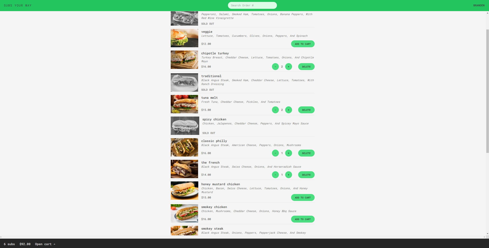

# Subs-Your-Way

Welcome to **Subs-Your-Way**! This app allows users to browse the menu, add, delete, and place orders for their favorite sandwiches.

## Screenshot


## Features

- **Browse Menu**: View a variety of sandwiches available.
- **Add to Order**: Select your favorite sandwiches and add them to your order.
- **Delete from Order**: Remove sandwiches from your order if you change your mind.
- **Place Order**: Finalize your order and get ready to enjoy your meal!

## Installation

1. Clone the repository:
    ```bash
    git clone https://github.com/yourusername/Subs-Your-Way.git
    ```
2. Navigate to the project directory:
    ```bash
    cd Subs-Your-Way
    ```
3. Install dependencies:
    ```bash
    npm install
    ```

## Usage

1. Start the development server:
    ```bash
    npm start
    ```
2. Open your browser and go to `http://localhost:5173` to use the app.


## License

This project is licensed under the MIT License. See the LICENSE file for details.

